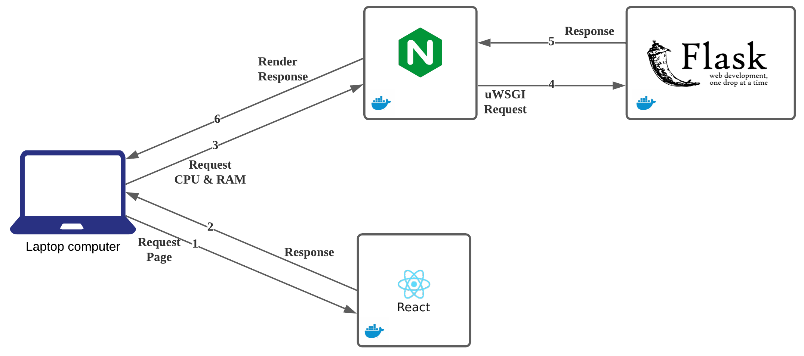
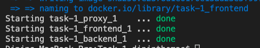
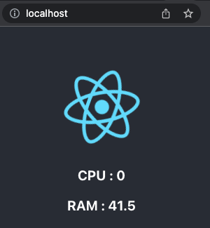

# React JS & Flask Application

 In this repo, you will find a simple Python - Flask Web App, which reads the current RAM and CPU usage and a React frontend which shows the statistics in the browser. The aim is to understand how an reactJS application works with different backend. Nginx reverse proxy is used as an interface between client and flask application, with the help of [uWSGI](ttps://uwsgi-docs.readthedocs.io/en/latest/) a flask application can be easily scalled. 

# Architecture 

1. Clients establish a connection with the react application.
2. The container responds with static material that the client must process (browser)
3. The browser requests the Nginx reverse proxy for CPU and RAM.
4. Nginx will use the uwsgi protocol to send the request to the backend flask application.
5. The flask application will just handle the request and return CPU and RAM data as a response.
6. Nginx will respond to the client and render the page as seen below.

# Floder Overview

Folder contains detailed application overview and instruction to build it.  

## backend

Contains the flask application, description of Dockerfile and steps are provided inside

## frontend

Contains the reactJS application, description of Dockerfile and steps are provided inside. 

## proxy

Contains Nginx rever proxy configureation and Dockerfile to build contianer image

# System Requirements

The following system requirements must be met in order for this program to run.

* [Docker](https://docs.docker.com/get-docker/)
* [docker-compose](https://docs.docker.com/compose/)

# Deploy Steps

1. Install above mentioned system dependency

2. clone this repository

3. In the root of the folder run below command, which will build the reactJS application and deploy it. Ensure lastest version of docker-compose is installed

> docker-compose  up -d --build

4. you should see below output for the deployment was successful

5. The application can be accessed on localhost.

# Cloud Deployment

Once we have tested it on our local, its time to run it on remote server, [Digitalocean](https://www.digitalocean.com/) is developer friendly cloud provider and best place to start if you are new to cloud, at a afforable price.

You can find detailed instruction to run it on cloud [here](https://github.com/dipinthomas/digitalocean-droplet-terraform)

# Kubernetes Deployment

Containerzing an application is never complete unless it can run on kubernetes, instructions to run on [minikube](https://minikube.sigs.k8s.io/docs/start/) can be found [here](https://github.com/dipinthomas/minikube-example)